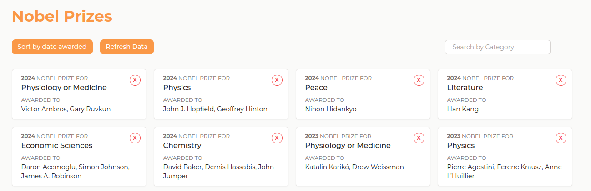
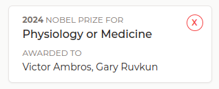

# The Trip Boutique - Junior Frontend Assignment

Thank you for applying to our Junior Frontend Developer position. This take-home assignment is our way to make the interview process more practical and focused on your actual technological skills. We will provide you with a structured project where you are expected to navigate and implement the requested features, as similar as possible to our current tech stack and the way we work internally.

We appreciate your availability, please bear in mind that this test is not supposed to take more than 4 to 6 hours to complete. After your submission, we will review your work. Depending on the quality of your work we will get in touch with you for a second interview, where we will go through your work together. Even if you are not selected, we will give you feedback on your submission.

We are developing a web application to display some recent Nobel Prize laureates. We are using the official API to get this information. You can check its documentation [here](https://app.swaggerhub.com/apis/NobelMedia/NobelMasterData/2.1#/default).
The project is already set up, but we would like you to implement some changes to its design and functionality. We are using Nuxt 3, which uses Vue 3. If you are not familiar with the framework, you can check its documentation [here](https://nuxt.com/docs/getting-started/introduction). Most of the tasks do not require familiarity with Nuxt, but it can be useful to navigate through the project structure.

To get started, please download and extract the zip file that was sent to you. In there you will find a typical Nuxt 3 project, already set up with some of the modules that you might need to use for questions, such as Pinia and Tailwind. If you are not familiar with these, do not worry, you can skip the optional questions.

To run the project, open the folder on your preferred code editor, open a terminal window and run the following commands in order: `npm run install` and `npm run dev` . Open your browser of choice and navigate to http://localhost:3000 . If everything went smoothly you should see the homepage of our application and you can get started.

If you run into configuration problems please do try to solve it yourself, but if they persist please send us an email detailing the problem or error you ran into. Although not mandatory, we recommend you do this test in any non-windows system and use any `node` version above 18. We might not be able to help as easily in other operating systems. To submit the task, simply zip the folder with the project and send it back with your name on the file. You can now get started on the tasks:

## Part 1:
Access the homepage of our application. You should see a list of recent Nobel Prize and some information about them. Open the corresponding file on our project (`index.html`) and apply the following features:

1. We want to be able to sort the awards by most recently awarded at the click of a button. Please implement the `sortByDateAwarded` function to achieve this.
2. The users might want to search by a specific category. We could do this with a dropdown, but we want it to be more complex. Using the text input field you see on the page, please implement the ability to search by Category name. For example, if we search for “Physics”, only the Nobel Prizes awarded in Physics should be displayed. Make the necessary changes to the `searchByCategoryName` or other locations in the page to achieve this.

(note: in the API request you will often see an object with the information displayed in three different languages. You should always access and display the english one)

## Part 2:
Design is an essential part of our work as front-end developers. We know that it’s not every developer's cup of tea, but it’s very important to us and a big part of our work at The Trip Boutique. Do your best with the following requests:

1. Looking at the following screenshot, try to recreate its styles in the `NobelPrize.vue` component. Use the nobel-prize-card-original class to add your styles. You must only use CSS for this step. (during this step, we recommend you also look at step 3.1, do them simultaneously if you wish, and then come back to the optional questions of this part 2)

A preview of the page:

The card to recreate:

2. (optional) If you are familiar with Tailwind, repeat the previous steps using only Tailwind classes. You do not need to add new classes or configurations to achieve this, but you can do it if you choose. Use the `nobel-prize-card-tailwind` for this. You do not need to show both styles simultaneously, just add the style to that class.
3. (optional) Got a flare for design? We like that. Duplicate the `NobelPrize.vue` file, rename the copy to `NobelPrizeSpecial.vue`. Make whatever design, show whatever information you want. Go nuts. Show what you can do. You can use either plain-old CSS or Tailwind for this step.

## Part 3:
Components are a crucial part of modern web development and exist across multiple frameworks, but more recently as part of vanilla Javascript as well. The `NobelPrize.vue` is our main component in the application.

1. The component is already receiving the information from its parent, under the prizes prop. Only using the HTML part of the code, display only the `NobelPrize` component for even years (2024, 2022, …).
2. On the `index.html` file, you will find the removePrize function. Implement this function to remove a prize from the list of prizes. This action should happen when a user clicks the red button on the `NobelPrize.vue` component. Implement this using parent-child component data communication mechanisms.
3. (optional) Data may be stale in some API requests. So now, we would like to implement a function to repeat the API request. We already went ahead and created this function at refreshData. Now we would like to send a notification to display that the data has been fetched. To achieve this, if you are familiar with state management in Vue (using Pinia), use the Notifications Store that we have already implemented to display a notification on the screen with any message you like.

(note: we are using the Vue 3 Composition API and we ask you to keep it that way. If you absolutely need to, you can change it to Options API, but you must make sure the end result is the same)

As a reminder, to submit your assignment please zip all the files for the project and name it after yourself. We appreciate your effort and will review your work carefully. If you have any feedback about this assignment feel free to let us know (too long, too hard, too easy, not enough detail, …).
